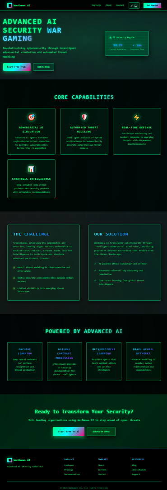

# TrustBuilder Wargames AI API Documentation

Modern, interactive homepage for TrustBuilder AI.

## 🚀 Quick Start

| Command            | Description                   |
| ------------------ | ----------------------------- |
| `pnpm install`     | Install dependencies          |
| `pnpm run dev`     | Start development server      |
| `pnpm run build`   | Build for production to dist/ |
| `pnpm run preview` | Preview production build      |
| `pnpm run lint`    | Run linting                   |
| `pnpm run format`  | Format code                   |

## Appearance

<details>
  <summary>GummyLoop Theme</summary>
  
</details>
<details>
  <summary>Cyberphnk Theme</summary>
  
</details>

## 🔧 Configuration

### 📋 Prerequisites

- Node.js 18+

### Environment Variables

Create `.env` file for API configuration:

```env
VITE_API_BASE_URL=https://wargames-ai.trb.ai
```

### Vite Config

Customize build settings in `vite.config.js`:

```js
export default {
  base: "/",
  build: {
    outDir: "dist",
    sourcemap: true,
  },
};
```

## 🎨 Tech Stack

- **Vite** - Build tool & dev server
- **Tailwind CSS** - Utility-first CSS
- **Flowbite** - UI components
- **Lucide Icons** - Icon library

## 🏗️ Project Structure

```
frontend/
├── public/              # Static assets
├── src/
│   └── themes/          # Themes
├── index.html           # HTML entry point
├── package.json         # Dependencies & scripts
└── README.md            #
```
